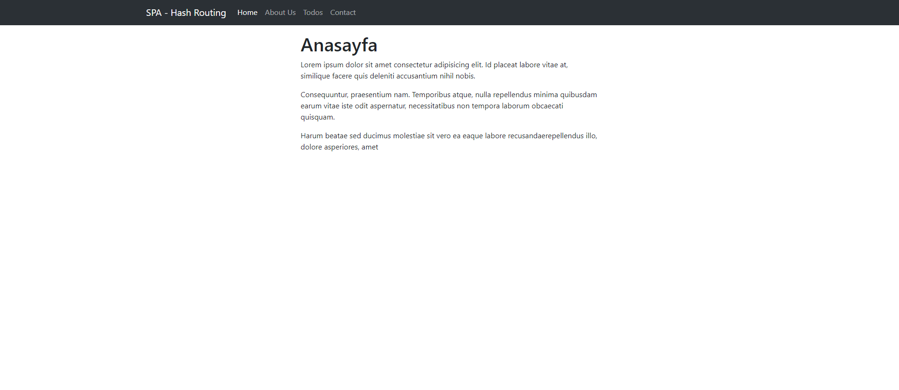

# Single-Page-App
## SPA

Bir js dosyasının o sayfada yüklenmesi ve herşeyin onun üzerinden yüklenmesi ve gitmesi anlamına gelir.

Aşağıdaki siteden hash tag ile ilgili bilgi alabiiliriz.

https://developer.mozilla.org/en-US/docs/Web/API/Location

